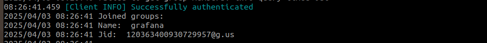

# Grafana Whatsapp Webhook

[](https://goreportcard.com/report/github.com/optiop/grafana-whatsapp-webhook)
[](https://join.slack.com/t/optioporg/shared_invite/zt-33axtzuao-Kd5NzaVm2GOhozBHOTj_Yg)

This repository acts as a webhook service that listens for Grafana alerts and forwards them to a specified WhatsApp number or group. It enables seamless integration of Grafana alerts with WhatsApp for real-time notifications.

## Setup and Usage

### 1. Generate a Random Token
Before using this repository, **generate a random token** using only numbers and alphabets. This token is **user-generated** and not an actual Meta token.

### 2. Configure the `.env` File
Create or edit the `.env` file and add the following values:
```
WHATSAPP_APP_TOKEN=your_generated_token
PHONE_NUMBER=your_phone_number_without_plus
```
> **Note:** Ensure the phone number is added **without the `+` sign** for the country code.

### 3. Run the Docker Container
Use the following command to start the service with Docker:
```bash
docker run -p 8080:8080 \
  -e WHATSAPP_APP_TOKEN=your_generated_token \
  -name grafana-whatsapp-webhook \
  --rm -v ./out:/app/out/ \
  -d ghcr.io/optiop/grafana-whatsapp-webhook:v0.1.5
```

### 4. Authenticate with WhatsApp
- **QR Code Generation:**
  - A QR code will be generated and saved into the `./out/qr.png` directory.
  - Alternatively, you can retrieve the QR code using:
    ```bash
    docker logs <container_name>
    ```

- **Link Device:**
  - Open WhatsApp, go to **Linked Devices**, and select **Link a Device**.
  - Scan the QR code from `./out/qr.png`.
  - Or use `docker logs grafana-whatsapp-webhook`

### 5. Retrieve the Group JID (for Group Alerts)
Once authentication is complete, stream logs to retrieve the WhatsApp **Group JID**:
```bash
docker logs -f <container_name>
```
Copy the **JID** of the group where you want to send alerts 
**only the number not @g.us or something else**.

**in this example  120363400930729957 is the group id for our .env file**
### 6. Configure Grafana Contact Points
Set up a **contact point** in Grafana using the following URLs:

- **For a user:**
  ```
  http://<your_ip>:8080/whatsapp/send/grafana-alert/user/<phone_number>/<WHATSAPP_APP_TOKEN>
  ```

- **For a group:**
  ```
  http://<your_ip>:8080/whatsapp/send/grafana-alert/group/<group_id>/<WHATSAPP_APP_TOKEN>
  ```
Replace `<your_ip>`, `<phone_number>`, `<group_id>`, and `<WHATSAPP_APP_TOKEN>` with your actual values **do not use localhost or 127.0.0.1 use the ip of your pc**.

> **⚠️ WARNING:** If you stop using this service, **unlink the device from WhatsApp** to maintain your account's security.

